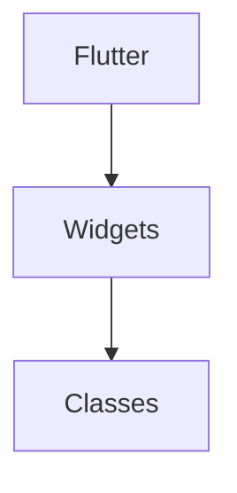
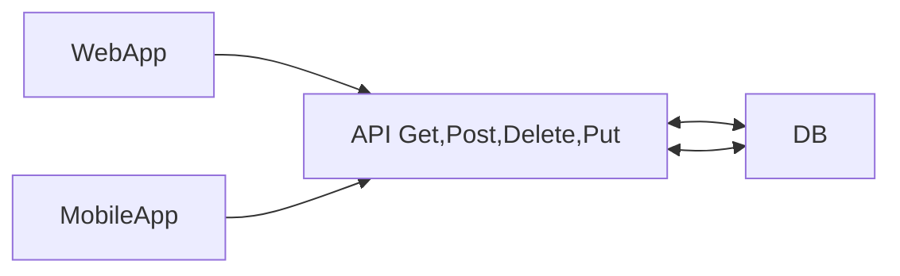
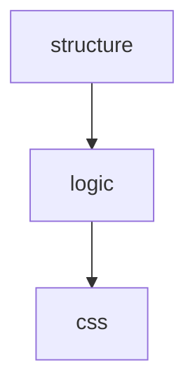
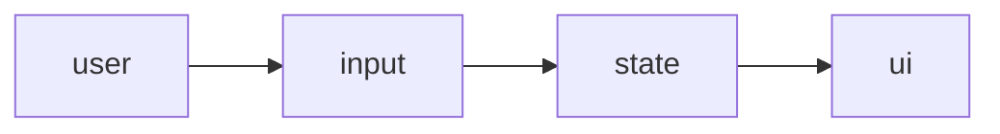

# Web Technology

## Flutter

In Flutter, **widgets** are **the fundamental building blocks used to create a user interface (UI)**. Unlike other frameworks that distinguish between views, layouts, and activities, Flutter treats nearly everything as a widget—including structural elements (buttons), stylistic elements (fonts), and even layout models (padding, rows).



```hcl
class User{
  String name;
  int age;
  User(this.name,this.age){}
  void display(){
    print("Name: ${name}, Age: ${age}");
  }
}

void main(){
User u=User("Khushi", 19);
u.display();

}
```



---

## Stateless Widgets

These are immutable( cannot be changed).

Example- about us page

| **React (JS)** | **Flutter(Dart)** |
| --- | --- |
| Function component | Class widget |
| JSX | Widget tree |
| Props | Constructor parameters |
| useState | Stateful widget |
| setState | setState (similar concept) |

```dart
import 'package:flutter/material.dart';

class MyApp extends StatelessWidget{
    final String name;
    final int age;
    const MyApp({required this.name, required this.age});

  @override
  Widget build(BuildContext context){
    return MaterialApp(
      home: Scaffold(
        appBar: AppBar(
        title: Text("My first flutter app"),
      ),
      body:Center(
        child: Column(
          mainAxisAlignment: MainAxisAlignment.center,
          children:[
            Text("Hello"),
            Text("Flutter"),
            Text("World"),
            Text("Name: $name"),
            Text("Age: $age"),
          ],  
        ),
      ),
      ),
    );
  }
}
```

---

## Stateful Widgets

These are mutable( can be changed).

Example- user interacting components- textbox, counter app.

```dart
import 'package:flutter/material.dart';

class Counter extends StatefulWidget {
  @override
  _CounterState createState() => _CounterState();
}

class _CounterState extends State<Counter> {
  int count = 0;

  void increment() {
    setState(() {
      count++;
    });
  }

  @override
  Widget build(BuildContext context) {
    return MaterialApp(
    home: Scaffold(
      appBar: AppBar(title: Text("Counter")),
      body: Center(
        child: Column(
          mainAxisAlignment: MainAxisAlignment.center,
          children: [
            Text("$count", style: TextStyle(fontSize: 30)),
            ElevatedButton(
              onPressed: increment,
              child: Text("Increment"),
            ),
          ],
        ),
      ),
    ),
    );
  }
}
```

#### Flutter Stateful widget structure



---

#### App flow diagram



---

# Container

`Container` is a **box widget. It is combination of multiple widgets**

You can use it to:

- hold child widgets
- style (color, border, radius)
- control size (width/height)
- add spacing (padding/margin)
- Padding + Align + DecoratedBox + SizedBox

| Web (HTML/CSS) | Flutter |
| --- | --- |
| `<div>` | `Container` |

### Components of widgets-

#### 1. width & height

```
Container(
width:200,
height:100,
)
```

#### 2. color

Background color

```
Container(
color:Colors.red,
)
```

#### 3. child

```
Container(
child:Text("Hello"),
)
```

Only ONE child allowed

#### 4. padding (INNER SPACE)

```
Container(
padding:EdgeInsets.all(20),
child:Text("Hello"),
)
```

Space **inside** container

#### 5. margin (OUTER SPACE)

```
Container(
margin:EdgeInsets.all(20),
)
```

Space **outside** container

| Property | Meaning |
| --- | --- |
| padding | inside space |
| margin | outside space |

#### 6. alignment

```
Container(
alignment:Alignment.center,
child:Text("Hello"),
)
```

Positions child inside container

#### 7. decoration

```
Container(
decoration:BoxDecoration(
color:Colors.blue,
borderRadius:BorderRadius.circular(10),
  ),
)
```

Used for:

- color
- border
- radius
- gradient

#### 8. border

```
decoration:BoxDecoration(
border:Border.all(color:Colors.black,width:2),
)
```

#### 9. borderRadius

```
borderRadius:BorderRadius.circular(20)
```

Makes rounded corners

#### Note:

Container only allows ONE child.

Do use color and decoration together.

```dart
import "package:flutter/material.dart";
class ProfileCard extends StatelessWidget {
  @override
  Widget build(BuildContext context) {
    return MaterialApp(
    home: Scaffold(
      appBar: AppBar(title: Text("Profile Card")),
      body: Center(
        child: Container(
          width: 250,
          padding: EdgeInsets.all(0),
          margin: EdgeInsets.all(20),
          decoration: BoxDecoration(
            color: Colors.blue,
            borderRadius: BorderRadius.circular(20),
            border: Border.all(color: Colors.black, width: 2),
            boxShadow: [
              BoxShadow(
                color: Colors.grey,
                blurRadius: 10,
                offset: Offset(5, 5),
              )
            ],
          ),
          child: Column(
            mainAxisSize: MainAxisSize.min,
            children: [
              CircleAvatar(
                radius: 40,
                backgroundColor: Colors.white,
                child: Icon(Icons.person, size: 40, color: Colors.blue),
              ),
              SizedBox(height: 10),
              Text(
                "Anjali",
                style: TextStyle(
                  fontSize: 20,
                  color: Colors.white,
                  fontWeight: FontWeight.bold,
                ),
              ),
              Text(
                "Flutter Developer",
                style: TextStyle(color: Colors.white70),
              ),
              SizedBox(height: 15),
              ElevatedButton(
                onPressed: () {}, //stateless widget
                child: Text("Follow"),
              ),
            ],
          ),
        ),
      ),
    ),
    );
  }
}
```


---

# Row

`Row` is a widget that arranges children **horizontally. It is a list of widgets arranged horizontally.**

Code-

```dart
Row(
  children: [
    Text("A"),
    Text("B"),
    Text("C"),
  ],
)
```

Output:

```dart
A   B   C
```

#### 1. Main AxisAlignment

Direction  of row is horizontal.

```dart
Row(
mainAxisAlignment: MainAxisAlignment.spaceBetween,
children: [
Text("A"),
Text("B"),
Text("C"),
],
)
```

| Value | Effect |
| --- | --- |
| start | left |
| end | right |
| center | middle |
| spaceBetween | equal gap |
| spaceAround | gap around |
| spaceEvenly | equal spacing |

#### 2. Cross AxisAlignment

It controls vertical alignment.

```dart
Row(
  crossAxisAlignment: CrossAxisAlignment.center,
  children: [
Text("A"),
Text("B"),
Text("C"),
],
)
```

| Value | Meaning |
| --- | --- |
| start | top |
| center | center |
| end | bottom |

#### Expanded

Use expanded keyword to prevent overflow. It divides space equally.

→Might overflow

```dart
Row(
  children: [
    Text("Long Text"),
    Text("Another Text"),
  ],
)
```

Using Expanded:

```dart
Row(
  children: [
    Expanded(child: Text("Long Text")),
    Expanded(child: Text("Another Text")),
  ],
)
```

---

# Column

`Column` places widgets **one below another (vertically).**

```dart
    Text("A"),
    Text("B"),
    Text("C"),
  ],
)
```

Output:

```dart
A
B
C
```

#### 1. Main AxisAlignment

Direction  of row is horizontal.

```dart
Column(
mainAxisAlignment: MainAxisAlignment.spaceBetween,
children: [
Text("A"),
Text("B"),
Text("C"),
],
)
```

| Value | Meaning |
| --- | --- |
| start | top |
| center | center |
| end | bottom |

#### 2. Cross AxisAlignment

It controls vertical alignment.

```dart
Column(
  crossAxisAlignment: CrossAxisAlignment.center,
  children: [
Text("A"),
Text("B"),
Text("C"),
],
)
```

| Value | Effect |
| --- | --- |
| start | left |
| end | right |
| center | middle |
| spaceBetween | equal gap |
| spaceAround | gap around |
| spaceEvenly | equal spacing |

#### Example-

```dart
import 'package:flutter/material.dart';

void main() {
  runApp(MaterialApp(home: ColumnExample()));
}

class ColumnExample extends StatelessWidget {
  @override
  Widget build(BuildContext context) {
    return Scaffold(
      appBar: AppBar(title: Text("Column Example")),
      body: Center(
        child: Column(
          mainAxisAlignment: MainAxisAlignment.spaceEvenly,
          children: [
            Container(width: 80, height: 80, color: Colors.orange),
            Container(width: 80, height: 80, color: Colors.purple),
            Container(width: 80, height: 80, color: Colors.teal),
          ],
        ),
      ),
    );
  }
}
```

3 boxes are stacked:

- top → middle → bottom
- evenly spaced

#### Time to recall:

| Feature | Row | Column |
| --- | --- | --- |
| Direction | Horizontal | Vertical |
| Main Axis | Left → Right | Top → Bottom |
| Cross Axis | Top ↕ Bottom | Left ↔ Right |

---

# LIST VIEW

Its just a scroller column. Preferable to be used there exists unlimited items as scroller works.

#### Example

```dart
ListView(
  children: [
    Text("Item 1"),
    Text("Item 2"),
    Text("Item 3"),
  ],
)
```

#### Output

```dart
Item 1
Item 2
Item 3
⬇ scroll
```

#### Types of ListView:

#### 1. ListView (children: [])

     For **small lists**

```vhdl
ListView(
children: [
Text("A"),
Text("B"),
  ],
)
```

#### 2. ListView.builder()

     For **large/dynamic lists**

```dart
ListView.builder(
  itemCount: 5,
  itemBuilder: (context, index) {
    return ListTile(
      leading: CircleAvatar(child: Icon(Icons.person)),
      title: Text("User $index"),
      subtitle: Text("Flutter Developer"),
    );
  },
)
```

### Why builder?

> Creates items **only when needed**
> 

> Saves memory
> 

> Used in real apps
> 

#### 3. Horizontal ListView

```dart
ListView(
scrollDirection:Axis.horizontal,
children: [
Container(width:100,color:Colors.red),
Container(width:100,color:Colors.green),
  ],
)
```

#### Output:

```dart
[Red] [Green] → scroll sideways
```

---

#### How to use Listview inside Column?

```
Column(
children: [
ListView(...)❌error
  ],
)
```

Fix:

```
Expanded(
child:ListView(...)
)
```

---

## ListView

Special widget for lists

```dart
ListTile(
  leading: Icon(Icons.person),
  title: Text("Anjali"),
  subtitle: Text("Flutter Developer"),
  trailing: Icon(Icons.arrow_forward),
)
```

#### Output:

```
👤  Anjali
    Flutter Developer        →
```

---

# Images

`Image` is a widget used to display pictures.

## Types of images in Flutter

| Type | Source |  |
| --- | --- | --- |
| Asset Image | stored in your project. | Image.asset("assets/image.png") |
| Network Image | from internet | Image.network(
"[https://picsum.photos/200](https://picsum.photos/200)",
) |
| File Image | from device | import 'package:image_picker/image_picker.dart'; |
| Memory Image | from bytes | import 'package:image_picker/image_picker.dart'; |